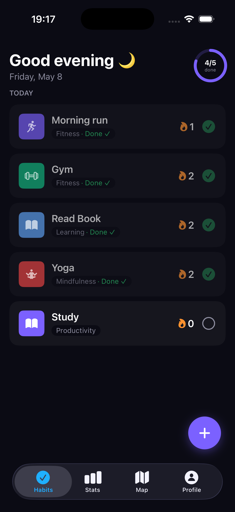
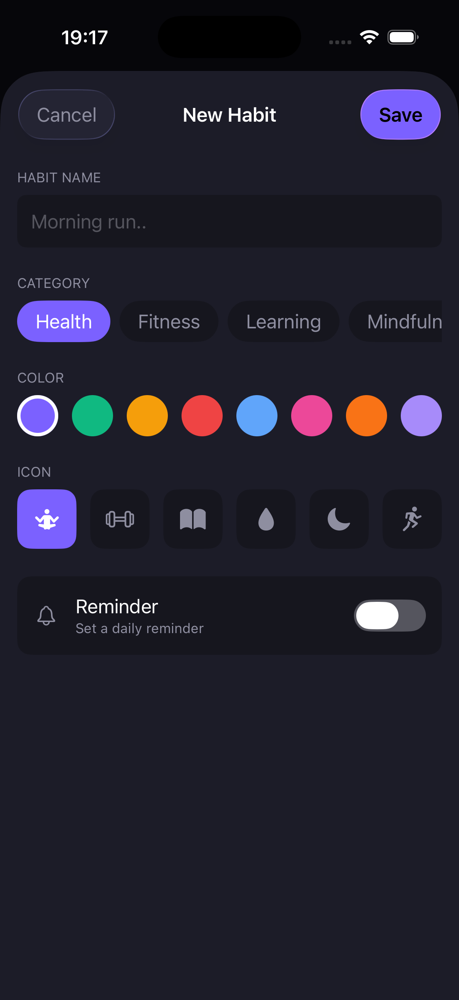
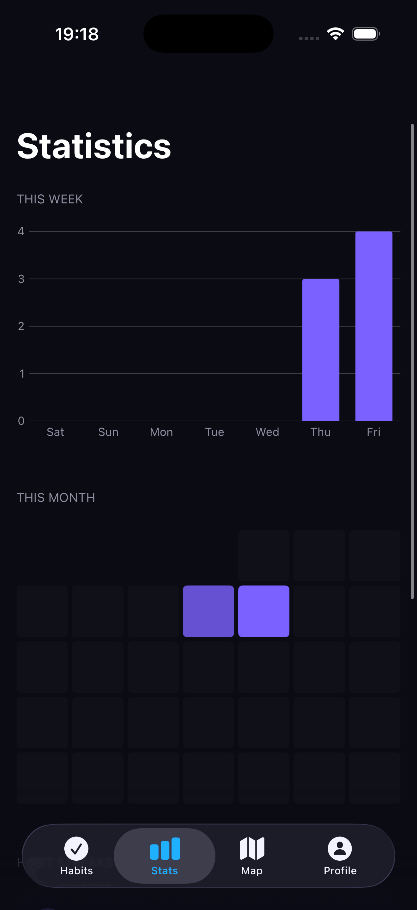
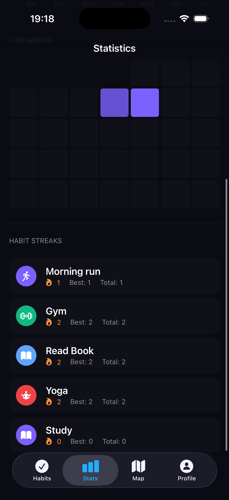
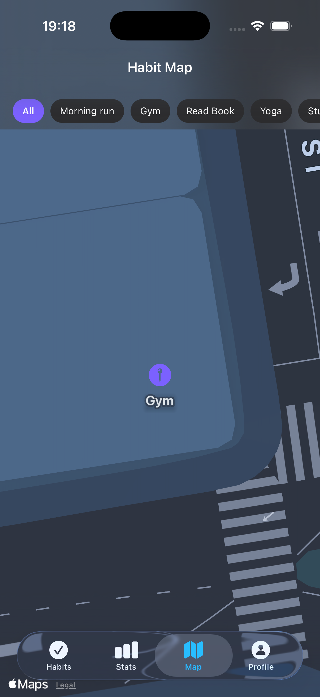
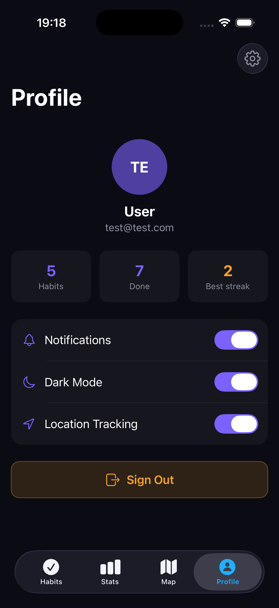

# Daily Done ✅

> *Small habits. Big streaks. One check at a time.*

**Daily Done** is an iOS habit tracker built to keep you honest with yourself — whether you're trying to drink more water, hit the gym, or just read for 10 minutes before bed. Check off your habits, watch your streaks grow, and never break the chain.
---

## What it does 🚀

| | |
|---|---|
| ✅ **Daily check-offs** | Tap to complete a habit for today. Simple as that. |
| 🔥 **Streaks** | Every consecutive day you complete a habit, your streak grows. Miss a day — back to zero. No mercy. |
| 🗺️ **Habit map** | GPS logs where you complete habits. Your morning run actually *on* the map. |
| 📊 **Stats** | Weekly bar charts and a monthly heatmap so you can see exactly when you crushed it — and when you didn't. |
| 🔔 **Reminders** | Set a daily notification per habit so you never forget. |
| 👤 **Profile** | Your personal stats hub. Dark mode included, obviously. |
| 🔐 **Auth** | Sign up and sign in with email — your data lives in the cloud via Firebase. |

---

## Screenshots 📱

| Habit List | Create Habit | Statistics |
|:----------:|:------------:|:----------:|
|  |  |  |

| Statistics (detail) | Map | Profile |
|:-------------------:|:---:|:-------:|
|  |  |  |

---

## Tech stack 🛠️

Built with SwiftUI and a clean MVVM architecture. No shortcuts (well, except `⌘R`).

| Layer | Technology |
|-------|------------|
| Language | Swift 6 |
| UI | SwiftUI |
| Architecture | MVVM |
| Backend | Firebase Firestore + Firebase Auth |
| Charts | Swift Charts |
| Maps | MapKit + CoreLocation |
| Notifications | UserNotifications |
| Packages | Swift Package Manager |

---

## Get it running 🏃

### Requirements
- Xcode 16+
- iOS 17+ simulator or device
- A Firebase project with Firestore and Authentication enabled

### 1. Clone

```bash
git clone https://github.com/PatNoO/daily_done.git
cd daily_done
```

### 2. Add your Firebase config

Daily Done talks to Firebase — you need to wire it up yourself:

1. Open [Firebase Console](https://console.firebase.google.com) → your project → iOS app
2. Download `GoogleService-Info.plist`
3. Drop it into `daily_done/GoogleService-Info.plist`

> The real plist is gitignored so no credentials end up in the repo. You must supply your own.

### 3. Open in Xcode

Open `daily_done.xcodeproj`. Xcode pulls the Firebase SDK via SPM automatically — just let it resolve.

### 4. Run

Pick **iPhone 16** (or later) from the simulator dropdown and hit **⌘R**. That's it.

---

## Project structure 🗂️

```
daily_done/
├── App/                      # Entry point, environment keys
├── Models/                   # Habit, HabitLog, HabitCategory
├── ViewModels/               # Business logic — HabitViewModel, StatsViewModel, etc.
├── Views/
│   ├── Auth/                 # Splash, Sign In, Sign Up
│   ├── Habits/               # Habit list, row, create sheet
│   ├── Statistics/           # Charts and heatmap
│   ├── Map/                  # Habit map
│   ├── Profile/              # Profile and settings
│   └── Shared/               # Reusable components
├── Services/
│   ├── Firebase/             # Firestore + Auth
│   ├── Location/             # GPS logging
│   └── Notifications/        # Local push notifications
└── Utilities/
    ├── Constants.swift        # Design tokens, colours, layout
    └── Extensions/           # Helpers and calculators
```

---

## What's next 🚧

Daily Done is still actively being developed. The app works end-to-end but there are more features and improvements planned before it's where I want it:

- **Edit habit** — update a habit's name, category, and colour after creation ([#70 DD-039](https://github.com/PatNoO/daily_done/issues/70))
- Continued polish, better onboarding, and improved mock data
- More to come — this app is a work in progress

Pull requests and feedback are welcome.

---

## License

MIT — do whatever you want with it, just maybe build your own streaks too. 💪
